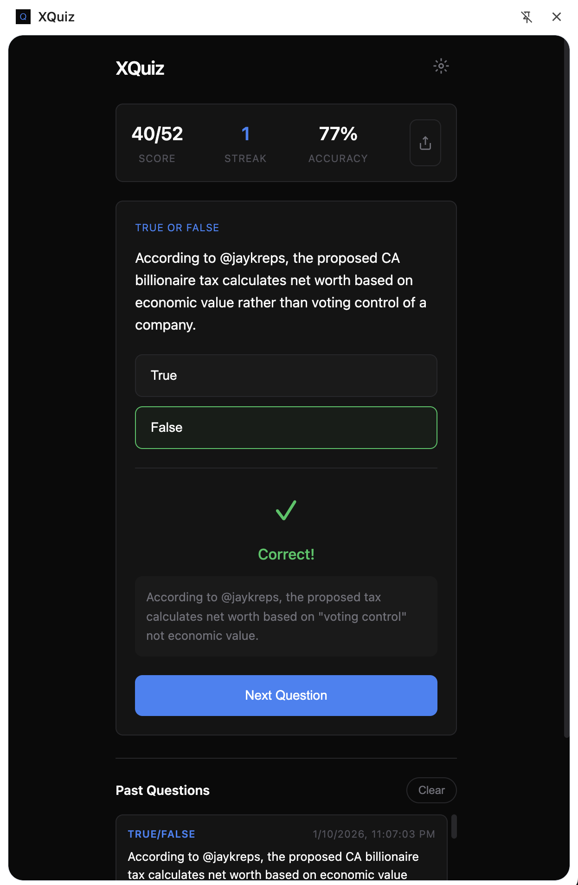
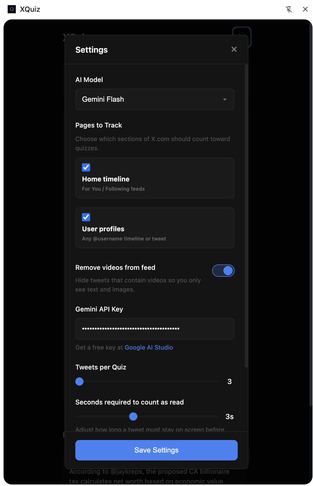

# XQuiz

A Chrome extension that tests your attention and retention while scrolling Twitter/X.

**Built entirely with AI agents. 100% vibe coded.**

## Screenshots

<p align="center">
  
  
</p>

## What it does

XQuiz monitors the tweets you scroll past on Twitter/X and periodically generates quiz questions to test how much you're actually absorbing. It uses Google's Gemini AI to create questions based on the content you've read.

## Features

- **Automatic tweet collection** - Tracks tweets as you scroll through your feed
- **AI-generated quizzes** - Creates multiple choice, true/false, and fill-in-the-blank questions
- **Progress tracking** - Monitors your score, accuracy percentage, and answer streaks
- **Shareable scorecards** - Generate and share your retention stats
- **Configurable** - Adjust how many tweets trigger a quiz
- **Video-free mode** - Optional toggle to hide videos from your feed when you want fewer distractions
- **Quiz history** - Review your most recent quiz questions and clear them whenever you like
- **Custom attention timer** - Pick how long a tweet must stay visible before it counts as “read”
- **Track specific pages** - Decide whether quizzes should monitor only the home feed or additional sections like user profiles

## Security considerations

- Your Gemini API key is stored only in Chrome's local storage (never synced to the cloud) and is only accessible from trusted extension surfaces.
- The key is sent to Google in the `x-goog-api-key` request header, never in the URL, and is never logged.
- Background message handlers validate the sender, preventing other extensions from querying your settings or stats.
- Permissions are kept minimal: `storage`, `sidePanel`, and host access to `x.com` / `twitter.com` only.

## Installation

XQuiz is built with [esbuild](https://esbuild.github.io/), so the extension is loaded from the generated `dist/` folder rather than the repository root.

1. Clone this repository and run `npm install`
2. Run `npm run build`
3. Open Chrome and navigate to `chrome://extensions`
4. Enable "Developer mode" (toggle in top right)
5. Click "Load unpacked" and select the `dist/` folder

After code changes, run `npm run build` again (or keep `npm run watch` running) and click the reload icon on the extension card.

## Setup

1. Click the XQuiz icon to open the side panel
2. Click the settings gear icon
3. Enter your [Gemini API key](https://aistudio.google.com/apikey)
4. Adjust tweets-per-quiz if desired (default: 5)

## Usage

1. Navigate to twitter.com or x.com
2. Open the XQuiz side panel by clicking the extension icon
3. Scroll through your feed as normal
4. When enough tweets are collected, a quiz will appear
5. Answer questions and track your retention!

## Project Structure

```
xquiz/
├── manifest.json               # Extension manifest (paths are relative to dist/)
├── icons/                      # Extension icons
├── scripts/
│   ├── build.mjs               # esbuild bundler -> dist/ (also copies static files)
│   └── package.mjs             # Builds and zips dist/ for the Chrome Web Store
├── src/
│   ├── shared/                 # Used by every context; no DOM, tiny chrome surface
│   │   ├── constants.js        # Message types, defaults, storage keys, limits
│   │   ├── logger.js           # Logger (debug output only in watch/debug builds)
│   │   ├── messaging.js        # sendMessage / message router / listeners
│   │   ├── settings.js         # Pure settings normalization
│   │   ├── stats.js            # Pure stats updates
│   │   ├── storage.js          # Promise-based chrome.storage + settings persistence
│   │   └── tweet-hash.js       # Pure tweet content hashing
│   ├── background/             # Service worker
│   │   ├── service-worker.js   # Entry point: registers listeners, merges handlers
│   │   ├── store.js            # Persisted write-through state (survives worker restarts)
│   │   ├── quiz-generator.js   # Gemini request/prompt, TWEETS_COLLECTED handler
│   │   ├── quiz-parser.js      # Pure JSON parsing/repair/validation of model output
│   │   ├── quiz-queue.js       # Persisted queue of quizzes waiting for the panel
│   │   ├── quiz-history.js     # Past questions log
│   │   ├── tweet-history.js    # Tweets already quizzed (de-duplication)
│   │   ├── stats.js            # Persisted score/streak
│   │   ├── settings-handlers.js# GET/UPDATE_SETTINGS
│   │   └── side-panel.js       # Side panel enable/open logic
│   ├── content/                # Content script (runs on x.com / twitter.com)
│   │   ├── content.js          # Entry point wiring the modules together
│   │   ├── page-tracker.js     # Which pages count (pure) + SPA navigation watcher
│   │   ├── tweet-extractor.js  # DOM selectors -> tweet data
│   │   ├── tweet-collector.js  # Buffer + de-duplication of read tweets
│   │   ├── attention-tracker.js# Hover-time based "read" detection
│   │   ├── status-indicator.js # Floating READING / NOT READING badge
│   │   ├── auto-open.js        # Opens the side panel on the next user gesture
│   │   └── distraction.js      # Hide video tweets
│   └── sidepanel/              # Side panel UI
│       ├── index.html, styles.css
│       ├── sidepanel.js        # Entry point: creates views, handles messages
│       ├── quiz-view.js        # Quiz card, progress counter, empty/error state
│       ├── settings-view.js    # Settings modal
│       ├── history-view.js     # Past questions list
│       ├── share-view.js       # Share modal (download / post to X)
│       ├── scorecard.js        # Canvas scorecard rendering
│       ├── stats-view.js       # Score / streak / accuracy bar
│       ├── answer-check.js     # Pure answer checking
│       └── dom.js              # DOM helpers
├── tests/                      # Unit tests (node --test)
└── dist/                       # Build output (gitignored) - load this in Chrome
```

## Development

Requires Node.js 20+.

| Command           | What it does                                                     |
| ----------------- | ---------------------------------------------------------------- |
| `npm run build`   | Bundle into `dist/` and verify every path in the manifest exists |
| `npm run watch`   | Rebuild on change, with debug logging enabled                    |
| `npm run lint`    | ESLint (flat config)                                             |
| `npm run format`  | Prettier (`npm run format:check` verifies without writing)       |
| `npm test`        | Unit tests with Node's built-in test runner                      |
| `npm run package` | Build and zip `dist/` into `xquiz-<version>.zip`                 |

CI (`.github/workflows/ci.yml`) runs install, lint, format check, tests and build on every push and pull request.

### Extending XQuiz

- **New message type**: add it to `MESSAGE_TYPES` in `src/shared/constants.js`. Handle requests in a background module by exporting a `messageHandlers` object (type -> `(message, sender) => response`) and spreading it into the router in `service-worker.js`. Send with `sendMessage(MESSAGE_TYPES.X, payload)`. Every request receives a response (`{ error }` on failure). For notifications to the panel/content script, use `broadcast()` and `listenForMessages()`.
- **New setting**: add its default (and limits) in `src/shared/constants.js`, handle it in `normalizeSettings` (`src/shared/settings.js`, with a test), add it to `SYNC_SETTING_KEYS` if it should sync, add the control to `index.html` and read/write it in `settings-view.js`.
- **New content-script feature**: create a module in `src/content/` exporting a factory/functions and initialise it in `init()` in `content.js`. Keep DOM selectors in `tweet-extractor.js` and decision logic in pure functions so they can be tested.
- **New side panel view**: add its markup to `index.html`, create `src/sidepanel/<name>-view.js` exporting `create<Name>View()` that looks up elements with `byId`, and instantiate it in `sidepanel.js`. Render untrusted text with `textContent`, never `innerHTML`.
- **New persisted background state**: use `createStore()` from `src/background/store.js` so state is reloaded after the service worker sleeps.

## Requirements

- Chrome browser (Manifest V3)
- Gemini API key

## License

[MIT](LICENSE) © Rishabh Ranawat
